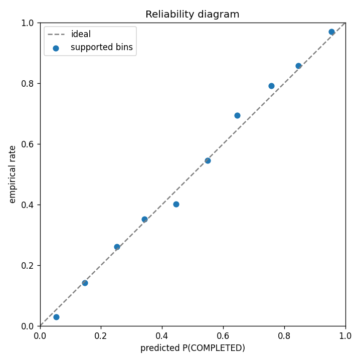
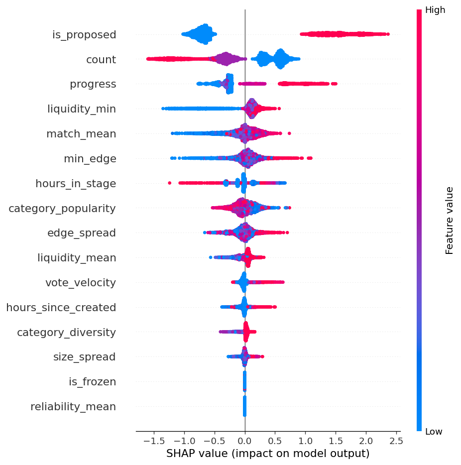
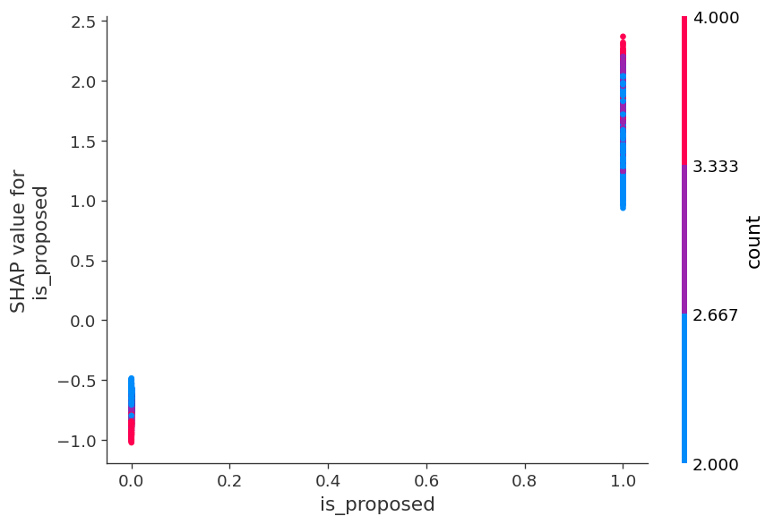
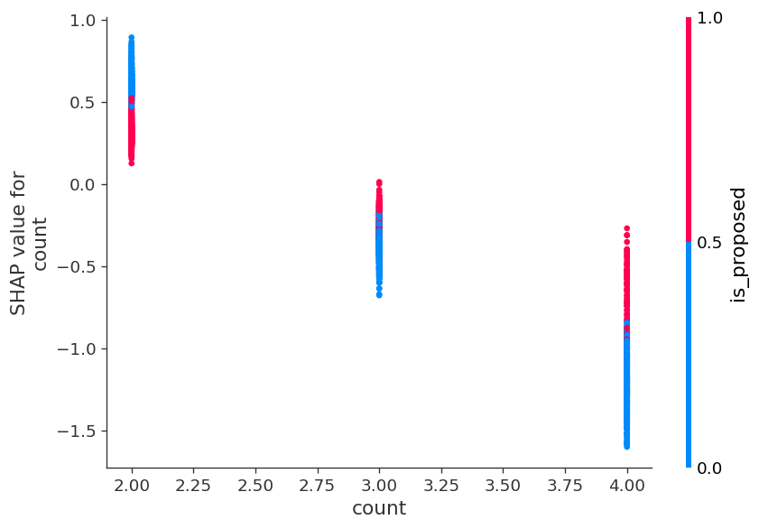
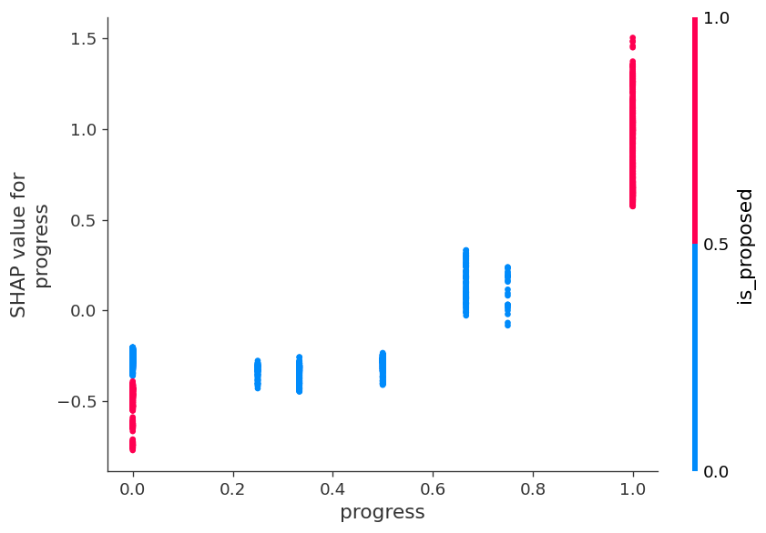
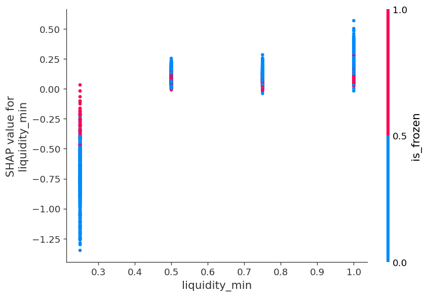
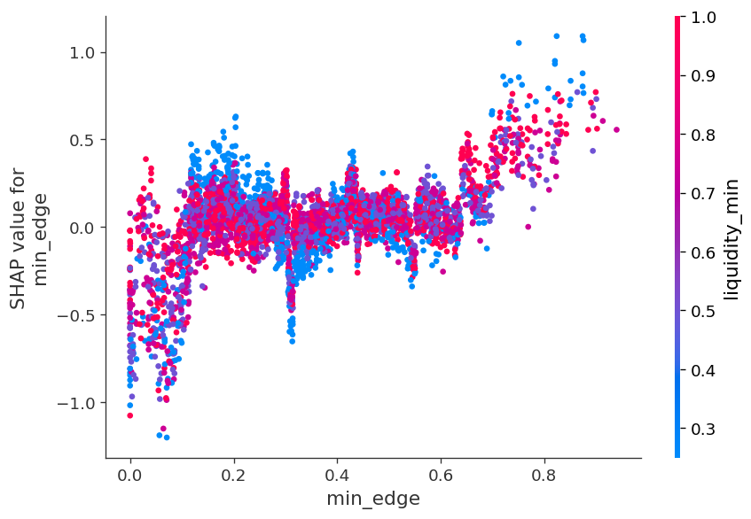
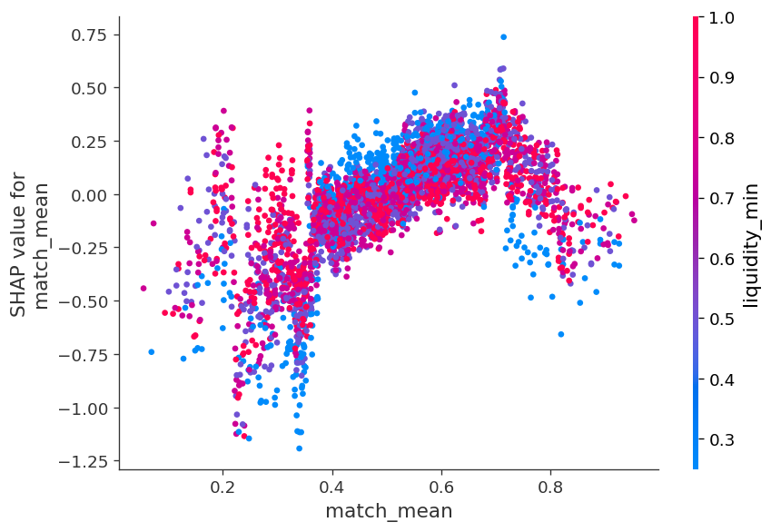

# Ranker v1 — LightGBM vs formula baseline

- seed: `42`
- LightGBM: `3.3.5` (text format v3)
- LightGBM best_iteration: `500`

## Gates

| gate | status | detail |
|---|---|---|
| delta_overall | PASS | AUC(LGBM)-AUC(formula)=0.0783 (want ≥ 0.02) |
| delta_ADD | PASS | ADD delta=0.1377 (want ≥ 0.02) |
| auc_cap | PASS | AUC(LGBM)=0.8776 (want < 0.95) |
| calibration | PASS | max |pred-emp| on supported bins=0.0480 (want ≤ 0.05) |
| shap_dgp | PASS | SHAP top4=['is_proposed', 'count', 'progress', 'liquidity_min']; DGP overlap=['count', 'is_proposed', 'liquidity_min', 'progress'] |
| reliability_shap | PASS | reliability_mean |SHAP| share=0.0000 (want ≈ 0) |

## AUC / log-loss

| slice | n | AUC LGBM | AUC formula | Δ AUC | logloss LGBM | logloss formula |
|---|---:|---:|---:|---:|---:|---:|
| overall | 4461 | 0.8776 | 0.7993 | +0.0783 | 0.4172 | 0.5718 |
| ADD | 2002 | 0.7664 | 0.6287 | +0.1377 | 0.4184 | 0.5692 |
| PROPOSED | 691 | 0.7698 | 0.5479 | +0.2219 | 0.5818 | 0.6889 |
| FROZEN | 466 | 0.7019 | 0.5324 | +0.1695 | 0.4521 | 0.4990 |
| IN_PROGRESS | 390 | 0.8201 | 0.4708 | +0.3493 | 0.1415 | 0.3193 |

## Stage completion (test)

| stage | n | P(COMPLETED) |
|---|---:|---:|
| CANDIDATE | 2914 | 0.1925 |
| PROPOSED | 691 | 0.5441 |
| FROZEN | 466 | 0.8069 |
| IN_PROGRESS | 390 | 0.9641 |

## Calibration

| bin | lo | hi | n | predicted | empirical | abs_err | supported |
|---|---|---|---|---|---|---|---|
| 0 | 0.0000 | 0.1000 | 956 | 0.0530 | 0.0303 | 0.0226 | True |
| 1 | 0.1000 | 0.2000 | 747 | 0.1476 | 0.1419 | 0.0057 | True |
| 2 | 0.2000 | 0.3000 | 670 | 0.2512 | 0.2612 | 0.0100 | True |
| 3 | 0.3000 | 0.4000 | 411 | 0.3416 | 0.3528 | 0.0112 | True |
| 4 | 0.4000 | 0.5000 | 261 | 0.4450 | 0.4023 | 0.0427 | True |
| 5 | 0.5000 | 0.6000 | 242 | 0.5496 | 0.5455 | 0.0042 | True |
| 6 | 0.6000 | 0.7000 | 258 | 0.6458 | 0.6938 | 0.0480 | True |
| 7 | 0.7000 | 0.8000 | 207 | 0.7580 | 0.7923 | 0.0342 | True |
| 8 | 0.8000 | 0.9000 | 301 | 0.8467 | 0.8571 | 0.0104 | True |
| 9 | 0.9000 | 1.0000 | 408 | 0.9547 | 0.9706 | 0.0159 | True |

## SHAP

Top-4: is_proposed, count, progress, liquidity_min

reliability_mean mean|SHAP| share = 0.0000

Визуальные проверки DGP: порог `min_edge` ≈ 0.35, пенальти `count=4`, насыщение `liquidity_min` на 1.0,
взаимодействие `match_mean × liquidity_min`, почти нулевой вклад константной `reliability_mean`.

### SHAP vs коэффициенты DGP

| фича | роль в симуляторе | mean\|SHAP\| rank |
|---|---|---:|
| `is_proposed` | выживание до PROPOSED (воронка) | 1 |
| `is_frozen` | выживание до FROZEN (воронка) | 15 |
| `progress` | доля подтверждений на стадии | 3 |
| `count` | пенальти n=4: −0.05/−0.08·(n−2) в pResp/pConf | 2 |
| `match_mean` | качество матча: +0.45·mean(c_e) в pResp | 5 |
| `min_edge` | слабое ребро цикла; порог матчера ≈ 0.35 | 6 |
| `liquidity_min` | min cluster size; насыщение на 1.0 | 4 |
| `reliability_mean` | константа 0.75, в DGP не участвует | 16 |

## Oracle (raw_json, не для обучения)

- errors: 847 / 4461
- P(error \| fraud)=0.1698; P(error \| ¬fraud)=0.1904
- P(error \| high \|ε\|)=0.1998; P(error \| lower \|ε\|)=0.1865
- fraud share overall 0.0238; among errors 0.0213
- fraud cases: 106; fraud in errors: 18
- top error reasons: {'completed': 560, 'no_show': 131, 'replacement_fail': 107, 'item_mismatch': 31, 'proposed_timeout': 18}

`fraud` даёт +0.6 к `p_mismatch` на ПВЗ (reason `item_mismatch`) и редок (~3%).
`no_show` — неотправка на ПВЗ после FROZEN, зависит от min(r). `|ε|` — шум размера кластера.
Irreducible error: латентки `r`/`fraud` не входят в X.

